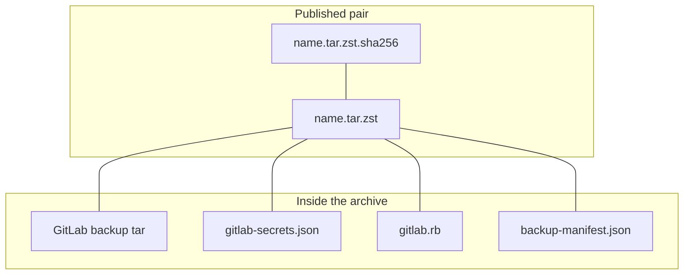

# GitLab backup pair

Run `xgic gitlab backup` and `xgic gitlab restore` on the host that already
runs Docker Compose for the
[xgic/gitlab](https://github.com/xgic/gitlab) stack. The command uses that
host's Docker client to run `gitlab-backup` in the official GitLab EE
service. It reads the live secrets file and `gitlab.rb` from the GitLab
config directory on that host, and it writes the pair into the backup
directory Compose mounts into GitLab EE. The orchestration image from
[xgic/gitlab-dev](https://github.com/xgic/gitlab-dev) stays the companion
service. This package is not installed into the GitLab EE image.

`xgic gitlab backup` publishes one `.tar.zst` and a sibling `.sha256`.
`xgic gitlab restore` checks that sidecar before it opens the archive, then
validates `backup-manifest.json`.



The sidecar is one `sha256sum` line: 64 lowercase hex digits, two spaces, the
archive file name, and a newline. Check it with `sha256sum -c` before opening
the archive. The manifest repeats the SHA-256 of the GitLab application tar.
It does not replace the sidecar.

Backup reads the live secrets file and the live `gitlab.rb`. It does not write
either file back. Restore writes them only when `--secrets-dest` or
`--config-dest` is set, and only after `--yes`.

## Registry, LFS, and packages

A full local GitLab backup contains `registry.tar.gz`, `lfs.tar.gz`, and
`packages.tar.gz`. The command fails when one of those members is missing.

GitLab can leave a member out. `gitlab-backup create SKIP=registry,lfs,packages`
omits those components, and an object-storage install does not put the blobs
in the tar. Pass the same names to `--allow-missing` when that absence is
intentional:

```bash
xgic gitlab backup \
  --secrets-file ./gitlab-secrets.json \
  --config-file ./gitlab.rb \
  --allow-missing registry,lfs \
  --dry-run
```

The default is to allow nothing. The manifest records an absent allowed
component under `artifacts.omitted`. Restore accepts that manifest. It still
rejects a tar that drops a component the manifest did not omit.

## Restore


With no `--archive`, restore uses the newest pair in `--backup-dir` whose
sidecar and manifest validate. `--dry-run` checks the sidecar and the manifest
and does not extract the archive.

## Manifest

`backup-manifest.json` is a Pydantic model. The JSON Schema generated from
that model is `src/xgic/cli/gitlab/schemas/backup-manifest.schema.json`.
Unknown fields are rejected.

`restore_validation.checks` records work for a later validator:

| `kind` | API | What backup records |
| --- | --- | --- |
| `rest` | GitLab REST | `GET /api/v4/version` when the tar name carries a version, and `GET /-/health` |
| `graphql` | GitLab GraphQL | A named query supplied by the caller |

Backup and restore do not call those APIs. A new check is a new model on that
union. Regenerate the schema after adding one.
